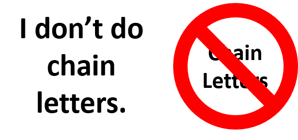

# Been BOO-ed Response
A response for the chain-letter variety of the "You've Been BOO-ed" message.




## Bottom Line Up Front

Here are the principal files.  ("These are files you're looking for.")

- The PDF rendering of the response: [Response-to-Getting-Booed.pdf](Response-to-Getting-Booed.pdf)
- Its source file: [Response-to-Getting-Booed.pptx](Response-to-Getting-Booed.pptx)

You are free to copy or update this work as you will; so please do.

The next sections of this README are the TL;DR parts.
  
## Background

OK, I guess I'm a little late to the party (October 2015) on this one, but apparently people at (at least) workplaces all over the country are anonymously leaving little Halloween notes with treats for other people.  I received one of these notes this year, accompanied with some yummy cookies.  Initially, I thought, "Gee, this is a nice thought. Sort of like Secret Santa."  But then, in the last half of the note, the bomb drops.  *It's a stupid chain letter!*

Here's the content of the letter I received (which I noticed was a variant of other ones on the "intertubes").

```
Hello!  You've Just Been Boo'ed!!!! [sic]

Since this is the time for goblins and bats,
For Halloween spirits, for ghosts and cats,
For weird happenings and witches' brew
These are the things that I wish for you....

May the only spirit you chance to meet
Be the spirit of love and friends warm and sweet,
May the only goblin that comes your way
Be this neighborhood phantom you must give away.
```

When I first read this -- this is only the first half by the way -- I thought that these were very nice sentiments and wishes.  I was touched.  Then I read the last phrase above -- "you must give away" -- and thought, "That's strange."  Then, upon reading the rest of it, the wheels really started to come off.

```
"T'is [sic] much better to give than to receive" goes the old verse
And something this easy won't empty your purse.
It's your turn to pass along a treat and a boo
Because now the [Company Name] phantom is little old you!

So by this time tomorrow, pick three friends sweet,
And give them each a Halloween treat.
You have only one day-so you'll need to hurry-
Leave the treat on their cube desk and then quickly scurry!

Signed,
The Phantom
```

Ah, a despicable chain letter!  So that's the nature of the thing!  I could pass this up, but then I saw that there was an addendum at the bottom of the page, which read:

> Now these are the things you will need to do:
> 
>   1. Make three copies of this letter and a phantom ghost for each.
> 
>   2. Post the phantom on your cube until Halloween.  This will ward off the phantom from returning to haunt you and others.
> 
>   3. The take the letter, a phantom and treat and deliver them to three cubes that do not have a phantom posted.

I don't know about you but my first thought upon reading this was not "Yes, I must comply," said in a robotic voice, but instead, ***"NO!  This must be stopped!"***  :)

## The Response

I thought about how I should respond to this.  I was truly thankful that someone thought of me and left me a treat with, what I'm sure the giver thought was, a nice note.  So, in my response, I wanted to be sure that I thanked this person.

(Now, this person went anonymous.  Why?  I don't know.  So now, I have no way to thank them personally.)

But I also wanted to write another note in response which took a stance squarely against chain letters, which I think in general are a very bad idea.  If that person were really a friend of mine ("pick three friends sweet"), then they would understand and respect my stance on chain letters.  (It's interesting to note that taking this stance is also a kind of test of the friendship, is it not?)

So, since the chain letter directed the victim recipient to "post the phantom on your cube until Halloween", I *will* post something on my cube until Halloween; not the phantom per se, but my own written response.

The following is the text of my response, but please find in this repo [a PDF](Response-to-Getting-Booed.pdf) and [a Powerpoint file (source)](Response-to-Getting-Booed.pptx) which contain the rendering I posted on my cube.  (And please feel free to copy or "plagiarize" it, if you want to use it for your own purposes.  No problems here.)

> My Response to GETTING BOOED
> 
> Thanks for leaving a treat!  That was very kind of you! (I wish I knew who you were though, but that’s another story.) However, I won’t “pass it along.”  If you knew me well, you’d already know that I don't do chain letters.
> 
> Chain letters are spam, pure and simple.  Spam is a waste of time and energy.  You have to ask yourself, if you want to do something nice for someone, why do you have to infer some obligation then on your recipient?  And that’s what makes the chain letter a bad kind of spam, and not conducive to freedom or being nice to your neighbor. :(  So, just don’t do it.  If everyone followed this advice, there would never again be chain letters, and the world would be a better place.  Just say no. :)

## Final thought

Just don't give, or encourage giving, this chain letter.  Here are some ideas that are better alternatives to "BOOing" somebody.

1.  Write them verse that you yourself composed, just for them.
2.  Give them a gift.  What I mean by that is that a true gift is gratis -- there are no strings attached, no obligations owed.
3.  Give gifts to people at *any time* of the year.  You don't have to give people gifts because everyone else is giving gifts at the same times during the year, in lock-step.  The poor recipient should probably be wondering how much thought is involved in lock-step, peer-pressure giving.  The answer is little to none.
